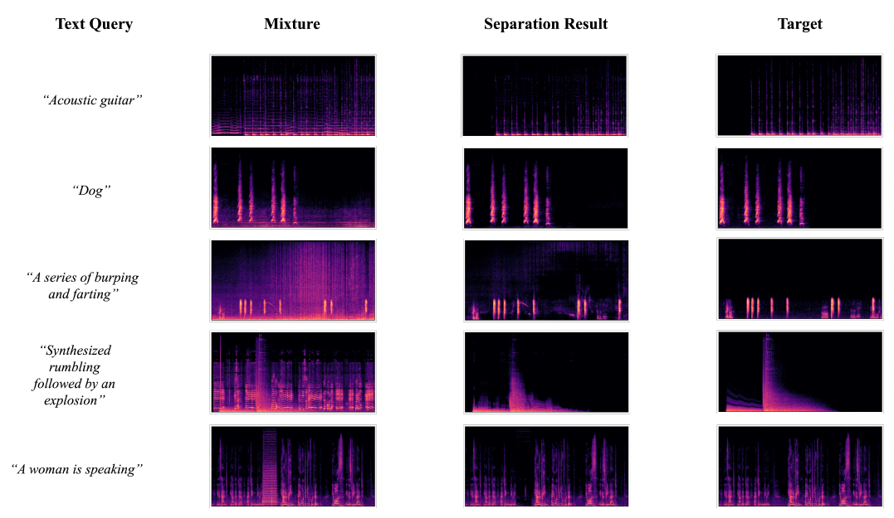

# Separate Anything You Describe
[](https://arxiv.org/abs/2308.05037) [](https://github.com/Audio-AGI/AudioSep/) [](https://audio-agi.github.io/Separate-Anything-You-Describe) [](https://colab.research.google.com/github/Audio-AGI/AudioSep/blob/main/AudioSep_Colab.ipynb) [](https://huggingface.co/spaces/Audio-AGI/AudioSep) [](https://replicate.com/cjwbw/audiosep) 


This repository contains the official implementation of ["Separate Anything You Describe"](https://audio-agi.github.io/Separate-Anything-You-Describe/AudioSep_arXiv.pdf).

We introduce AudioSep, a foundation model for open-domain sound separation with natural language queries. AudioSep demonstrates strong separation performance and impressive zero-shot generalization ability on numerous tasks, such as audio event separation, musical instrument separation, and speech enhancement. Check out the separated audio examples on the [Demo Page](https://audio-agi.github.io/Separate-Anything-You-Describe/)!

<p align="center">
  
</p>

<hr>

## TODO
- [x] AudioSep training & fine-tuning code release.
- [x] AudioSep base model checkpoint release.
- [x] Evaluation benchmark release.

<hr>

## Setup
Clone the repository and setup the conda environment: 

  ```shell
  git clone https://github.com/Audio-AGI/AudioSep.git && \
  cd AudioSep && \ 
  conda env create -f environment.yml && \
  conda activate AudioSep
  ```
Download [model weights](https://huggingface.co/spaces/Audio-AGI/AudioSep/tree/main/checkpoint) at `checkpoint/`.

<hr>

## Inference 


  ```python
  from pipeline import build_audiosep, inference
  import torch

  device = torch.device('cuda' if torch.cuda.is_available() else 'cpu')

  model = build_audiosep(
        config_yaml='config/audiosep_base.yaml', 
        checkpoint_path='checkpoint/audiosep_base_4M_steps.ckpt', 
        device=device)

  audio_file = 'path_to_audio_file'
  text = 'textual_description'
  output_file='separated_audio.wav'

  # AudioSep processes the audio at 32 kHz sampling rate  
  inference(model, audio_file, text, output_file, device)
  ```

<hr>

To load directly from Hugging Face, you can do the following:

  ```python
  from models.audiosep import AudioSep
  from utils import get_ss_model
  import torch

  device = torch.device('cuda' if torch.cuda.is_available() else 'cpu')

  ss_model = get_ss_model('config/audiosep_base.yaml')

  model = AudioSep.from_pretrained("nielsr/audiosep-demo", ss_model=ss_model)

  audio_file = 'path_to_audio_file'
  text = 'textual_description'
  output_file='separated_audio.wav'

  # AudioSep processes the audio at 32 kHz sampling rate  
  inference(model, audio_file, text, output_file, device)
  ```
<hr>

Use chunk-based inference to save memory:
  ```python
  inference(model, audio_file, text, output_file, device, use_chunk=True)
  ```

## Training 

To utilize your audio-text paired dataset:

1. Format your dataset to match our JSON structure. Refer to the provided template at `datafiles/template.json`.

2. Update the `config/audiosep_base.yaml` file by listing your formatted JSON data files under `datafiles`. For example:

```yaml
data:
    datafiles:
        - 'datafiles/your_datafile_1.json'
        - 'datafiles/your_datafile_2.json'
        ...
```

Train AudioSep from scratch:
  ```python
  python train.py --workspace workspace/AudioSep --config_yaml config/audiosep_base.yaml --resume_checkpoint_path checkpoint/ ''
  ```

Finetune AudioSep from pretrained checkpoint:
  ```python
  python train.py --workspace workspace/AudioSep --config_yaml config/audiosep_base.yaml --resume_checkpoint_path path_to_checkpoint
  ```

<hr>

## Benchmark Evaluation
Download the [evaluation data](https://drive.google.com/drive/folders/1PbCsuvdrzwAZZ_fwIzF0PeVGZkTk0-kL?usp=sharing) under the `evaluation/data` folder. The data should be organized as:

```yaml
evaluation:
    data:
        - audioset/
        - audiocaps/
        - vggsound/
        - music/
        - clotho/
        - esc50/
```
Run benchmark inference script, the results will be saved at `eval_logs/`
```python
python benchmark.py --checkpoint_path audiosep_base_4M_steps.ckpt

"""
Evaluation Results:

VGGSound Avg SDRi: 9.144, SISDR: 9.043
MUSIC Avg SDRi: 10.508, SISDR: 9.425
ESC-50 Avg SDRi: 10.040, SISDR: 8.810
AudioSet Avg SDRi: 7.739, SISDR: 6.903
AudioCaps Avg SDRi: 8.220, SISDR: 7.189
Clotho Avg SDRi: 6.850, SISDR: 5.242
"""
```

## Cite this work

If you found this tool useful, please consider citing
```bibtex
@article{liu2023separate,
  title={Separate Anything You Describe},
  author={Liu, Xubo and Kong, Qiuqiang and Zhao, Yan and Liu, Haohe and Yuan, Yi and Liu, Yuzhuo and Xia, Rui and Wang, Yuxuan and Plumbley, Mark D and Wang, Wenwu},
  journal={arXiv preprint arXiv:2308.05037},
  year={2023}
}
```
```bibtex
@inproceedings{liu22w_interspeech,
  title={Separate What You Describe: Language-Queried Audio Source Separation},
  author={Liu, Xubo and Liu, Haohe and Kong, Qiuqiang and Mei, Xinhao and Zhao, Jinzheng and Huang, Qiushi, and Plumbley, Mark D and Wang, Wenwu},
  year=2022,
  booktitle={Proc. Interspeech},
  pages={1801--1805},
}
```
